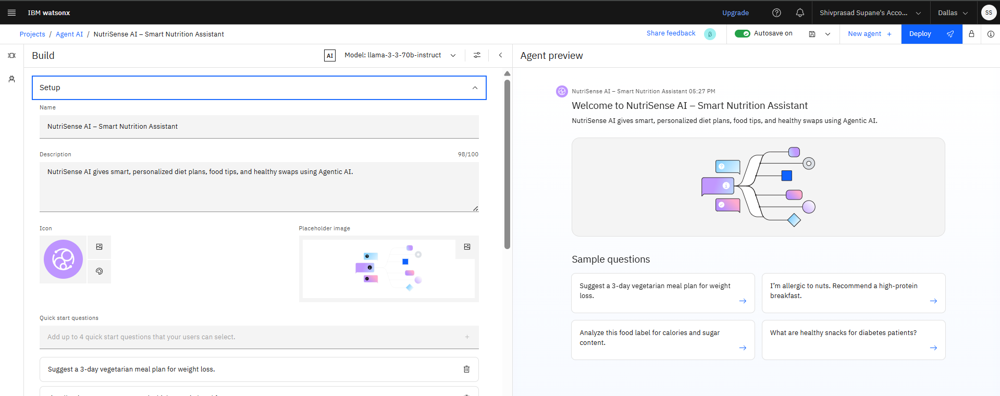
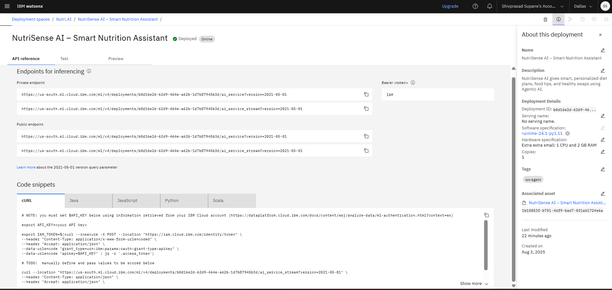

# 🤖🍏 NutriSense AI – The Smartest AI Nutrition Assistant

NutriSense AI is a **Generative Agentic AI-powered nutrition assistant** designed to deliver personalized meal plans, real-time food analysis, and healthy dietary recommendations. By leveraging **IBM Watsonx.ai** and cutting-edge AI models, NutriSense AI helps users make informed dietary choices tailored to their goals, health conditions, and preferences.

---

## 🧩 Problem Statement

Most diet applications fail to provide **personalized, adaptive, and real-time nutrition guidance**, leading to poor dietary decisions and inconsistent health outcomes.

Challenges include:
- Generic meal plans not tailored to user goals.
- Lack of dietary support for conditions like diabetes, allergies, or hypertension.
- No real-time analysis of food labels or meal images.

---

## 💡 Proposed Solution

NutriSense AI leverages **IBM Watsonx.ai Agent Lab** and **Granite LLM** to offer:
- Personalized meal recommendations considering goals, health conditions, allergies, and preferences.
- Healthy food swap suggestions with detailed explanations.
- Real-time nutrition analysis from food images and labels.
- Continuous adaptation based on user feedback and evolving dietary needs.

---

## 🌟 Key Features

- ✅ **Personalized Meal Plans:** AI-driven recommendations for weight loss, muscle gain, and overall health.
- 🔄 **Healthy Food Swaps:** Smarter alternatives for better nutrition.
- 📷 **Image-Based Analysis:** Upload food labels or meal photos for instant insights.
- 🧠 **AI-Powered Explanations:** Clear reasoning behind every suggestion.
- 🌍 **Scalable & Accessible:** Suitable for individuals, nutritionists, and health organizations.

---

## 🛠 Technologies Used

- **IBM Watsonx.ai Studio:** Build, train, and deploy the AI agent.
- **Granite Foundation Model (LLM):** Understands and processes nutrition-related queries.
- **Watson Discovery / RAG:** Retrieves dietary data from structured knowledge bases.
- **Cloud Object Storage:** Stores nutritional datasets and user preferences.
- *(Optional)* IBM Visual Recognition: For food image label reading and analysis.

---

## ☁️ IBM Cloud Services Used

- IBM Watsonx.ai Studio
- IBM Granite LLM
- Watson Discovery (RAG)
- IBM Cloud Object Storage
- IBM Cloud IAM for secure access

---

## 👥 Target Users

- General public seeking **healthy diet plans**  
- **Fitness enthusiasts** for tailored nutrition  
- People with **medical dietary restrictions**  
- **Nutritionists** wanting AI support for consultations  
- Students and professionals seeking **quick, accessible advice**  

---

## 🚀 How It Works

1. **User Input:** Enter preferences, goals, or upload food images.  
2. **Processing:** AI interprets your query using Granite LLM.  
3. **Data Retrieval:** Relevant information fetched via Watson Discovery (RAG).  
4. **Response Generation:** Personalized meal plans or recommendations provided instantly.  

---

## 🖼️ Screenshots

🔹 **Agent Setup**  

🔹 **Agent Instructions**  

🔹 **User Interaction**  

🔹 **Deployment**  

🔹 **API Reference**  

---

## 📄 Project File

📌 [ProjectTemplate final.pdf](ProjectTemplate%20final.pdf) – Full project presentation and documentation.

---

## 🛣 Future Enhancements

- 🎙 **Voice-enabled Queries:** Speech-to-text support for hands-free nutrition advice.  
- 📱 **Mobile App:** Companion app for on-the-go recommendations.  
- 🌐 **Multilingual Support:** Global access via IBM Language Translator.  
- ⌚ **Real-Time Feedback:** Integration with wearables and fitness trackers.

---

## 🔗 Useful Links

- [IBM Cloud Lite](https://cloud.ibm.com)  
- [IBM Watsonx.ai](https://www.ibm.com/watsonx)  
- [USDA Nutrition Guidelines](https://www.usda.gov)  
- [WHO Nutrition Guidelines](https://www.who.int/nutrition)  

---

## 👨‍💻 Author

**Shivprasad Supane**  
D Y Patil International University – Department of Computer Science

---

## ⚖️ License

This project is licensed under the **MIT License**.  
For academic and educational purposes only.

