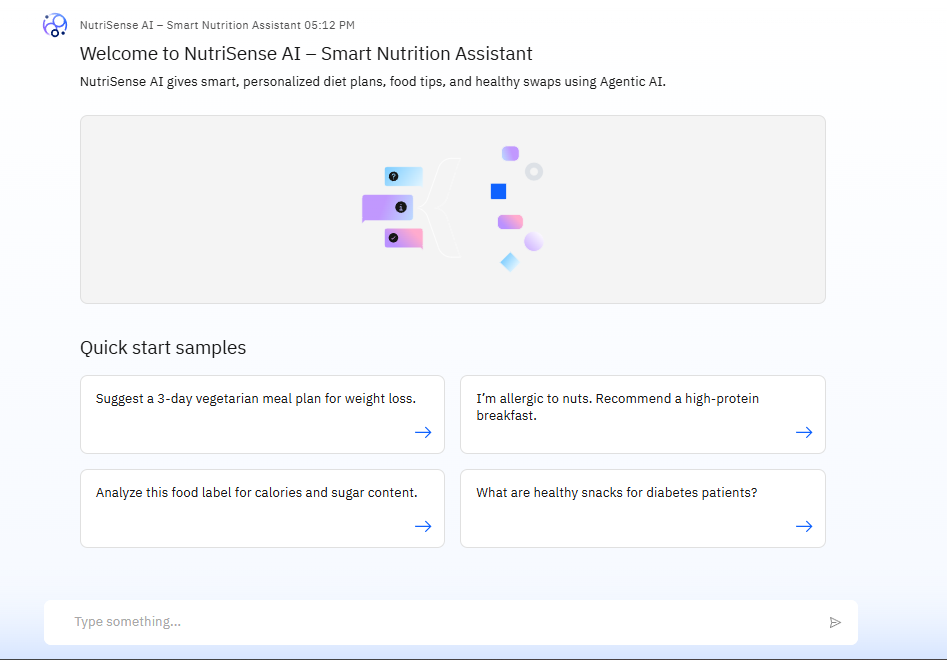
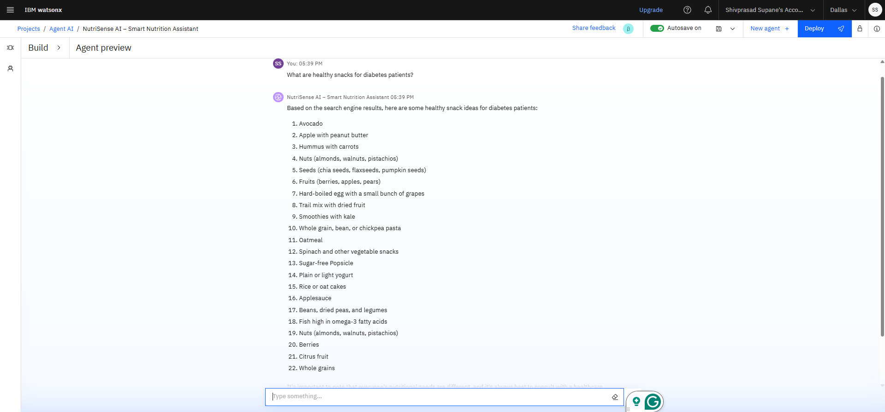

# 🍏 NutriSense AI – Smart Nutrition Assistant

NutriSense AI is a **Generative Agentic AI-powered assistant** designed to provide personalized meal plans, real-time nutrition analysis, and adaptive dietary recommendations using **IBM Watsonx.ai Agent Lab**.

---

## 🚀 Features
- ✅ Personalized diet plans based on user goals & allergies  
- 📷 Food label image analysis for nutrition insights  
- 🔄 Dynamic healthy food swaps with reasoning  
- 🤖 Continuous adaptation using Agentic AI tools  

---

## 🛠 Tech Stack
- **IBM Watsonx.ai Agent Lab** – Agent orchestration  
- **Granite LLM** – Natural language reasoning  
- **Watson Discovery (RAG)** – Data retrieval for meal recommendations  
- **Cloud Object Storage** – Dataset storage (recipes, nutrition facts)  
- *(Optional)* **IBM Visual Recognition** – Food label image analysis  

---

## 📄 Project File
📌 [NutriSense_AI_Presentation.pdf](NutriSense_AI_Presentation.pdf) – Full project report and slides

---

## 📷 Screenshots
*(Add your screenshots in an `images` folder and rename them accordingly)*

  

---

## 🌱 Future Scope
- Integration with **fitness trackers and wearables**  
- **Multi-language support** for wider reach  
- **AI-powered nutrient deficiency detection**  
- Collaboration with **dieticians and health apps** for real-world deployment  

---

## 👨‍💻 Author
**Shivprasad Supane**  
D Y Patil International University – Department of Computer Science

---

© 2025 Shivprasad Supane. This project is created for academic purposes only.

